<picture>
  <source media="(prefers-color-scheme: dark)" srcset="assets/hero-dark.svg">
  <source media="(prefers-color-scheme: light)" srcset="assets/hero-light.svg">
  
</picture>

I build AI for the parts of engineering that never sleep. At **Genpact** I'm building **Relay**, a 24×7 incident-resolution agent that pulls telemetry, ServiceNow tickets, Slack threads, bridge-call context and past incidents into one evidence-grounded answer, so the next shift starts where the last one stopped.

My rule for every AI system I ship: **the model interprets, deterministic code calculates, and a human approves anything that persists.**

<br>

<picture>
  <source media="(prefers-color-scheme: dark)" srcset="assets/h-now-dark.svg">
  <source media="(prefers-color-scheme: light)" srcset="assets/h-now-light.svg">
  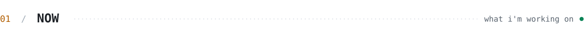
</picture>

```text
▸ trace  purna.profile                                        status: running
  ├─ role ........ Technical Associate · AI Automation & Cloud Ops @ Genpact
  ├─ building .... Relay: 24×7 incident-resolution agent for three-shift ops
  ├─ focus ....... agents · RAG · MCP · evidence-grounded LLM systems
  ├─ on call ..... P1/P2 incidents across AWS + Azure
  ├─ credential .. Claude Certified Architect, Foundations (Anthropic, 2026)
  ├─ ip .......... co-inventor, Indian patent application 202541062540
  ├─ won ......... HackSRM 2024: wave.io, multilingual diarisation in 24h
  └─ edu ......... B.Tech CSE, Big Data · SRM University AP · 2025
```

<br>

<picture>
  <source media="(prefers-color-scheme: dark)" srcset="assets/h-work-dark.svg">
  <source media="(prefers-color-scheme: light)" srcset="assets/h-work-light.svg">
  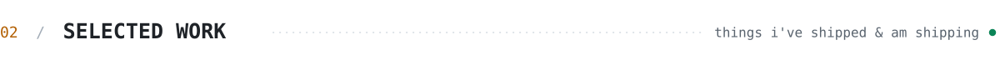
</picture>

<p>
<picture><source media="(prefers-color-scheme: dark)" srcset="assets/card-relay-dark.svg"><source media="(prefers-color-scheme: light)" srcset="assets/card-relay-light.svg"></picture>
<a href="https://github.com/PurnaJear06/Tracend"><picture><source media="(prefers-color-scheme: dark)" srcset="assets/card-tracend-dark.svg"><source media="(prefers-color-scheme: light)" srcset="assets/card-tracend-light.svg">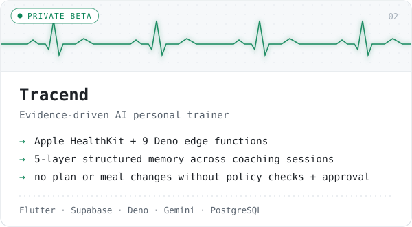</picture></a>
<a href="https://github.com/PurnaJear06/Hireind"><picture><source media="(prefers-color-scheme: dark)" srcset="assets/card-hireind-dark.svg"><source media="(prefers-color-scheme: light)" srcset="assets/card-hireind-light.svg">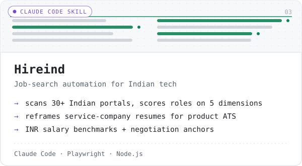</picture></a>
<a href="https://github.com/PurnaJear06/GridWatch"><picture><source media="(prefers-color-scheme: dark)" srcset="assets/card-gridwatch-dark.svg"><source media="(prefers-color-scheme: light)" srcset="assets/card-gridwatch-light.svg">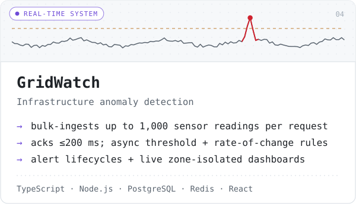</picture></a>
<a href="https://github.com/PurnaJear06/eoc-roster-generator"><picture><source media="(prefers-color-scheme: dark)" srcset="assets/card-roster-dark.svg"><source media="(prefers-color-scheme: light)" srcset="assets/card-roster-light.svg">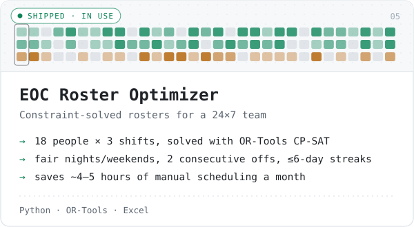</picture></a>
<a href="https://github.com/PurnaJear06/classroom-behavior-analysis"><picture><source media="(prefers-color-scheme: dark)" srcset="assets/card-classroom-dark.svg"><source media="(prefers-color-scheme: light)" srcset="assets/card-classroom-light.svg">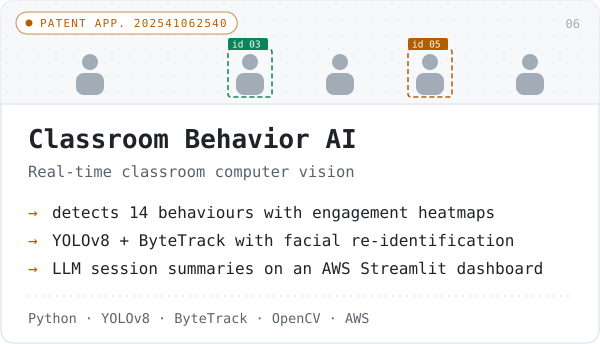</picture></a>
</p>

<details>
<summary><b>More from the archive</b></summary>
<br>

| Project | What it is | Built with |
| --- | --- | --- |
| [ChartSense AI](https://github.com/PurnaJear06/ChartSense-Ai) | Trading-chart analysis with computer vision | Python, OpenCV |
| [Edge Detector App](https://github.com/PurnaJear06/Edge-Detector-App) | Real-time Android edge detection | C++ NDK, OpenCV, OpenGL ES |
| [Expense iOS](https://github.com/PurnaJear06/Expense-iOS) | Expense and budget tracker | SwiftUI, Core Data |
| [Web CAD Viewer](https://github.com/PurnaJear06/Web-based-CAD-viewer) | STL / OBJ model viewer in the browser | TypeScript, Three.js |
| [Todo Summary Assistant](https://github.com/PurnaJear06/Todo-Summary-Assistant) | Task manager with LLM summaries sent to Slack | React, Node.js |
| [Real Estate Price Prediction](https://github.com/PurnaJear06/Project-Real-Estate-Price-Prediction) | Scraping → EDA → model → Streamlit, for Mumbai | scikit-learn, Streamlit |
| [Document Scanning System](https://github.com/PurnaJear06/Document-Scanning-System) | OCR document digitiser | Python, OpenCV, Tesseract |

</details>

<br>

<picture>
  <source media="(prefers-color-scheme: dark)" srcset="assets/h-stack-dark.svg">
  <source media="(prefers-color-scheme: light)" srcset="assets/h-stack-light.svg">
  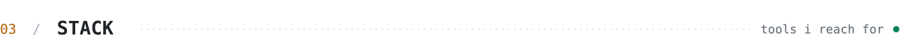
</picture>

<picture>
  <source media="(prefers-color-scheme: dark)" srcset="assets/stack-dark.svg">
  <source media="(prefers-color-scheme: light)" srcset="assets/stack-light.svg">
  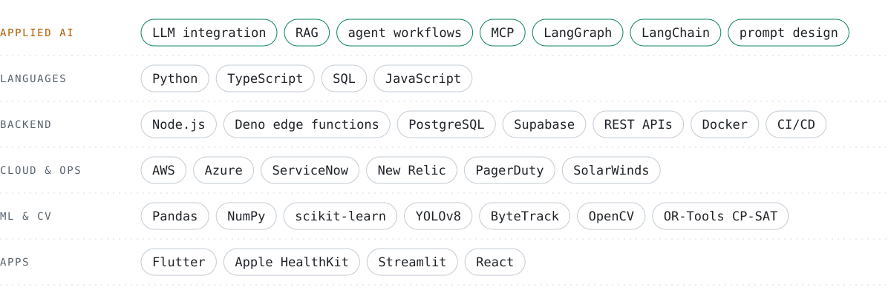
</picture>

<br>

<picture>
  <source media="(prefers-color-scheme: dark)" srcset="assets/h-telemetry-dark.svg">
  <source media="(prefers-color-scheme: light)" srcset="assets/h-telemetry-light.svg">
  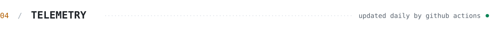
</picture>

<!-- activity:start -->
```text
$ tail -n 8 ~/ops/activity.log
2026-10-09 15:01  MERGED  Tracend        #93 Security 5/5: Keychain session storage, pin…
2026-10-09 14:17  PUSH    Tracend        6 pushes across 6 branches
2026-10-09 13:34  OPENED  Tracend        #93 Security 5/5: Keychain session storage, pin…
2026-10-09 13:22  OPENED  Tracend        #92 Security 4b/5: meal-photo AI notice, AI not…
2026-10-09 13:11  OPENED  Tracend        #91 Security 4a/5: AI budget reservations, glob…
2026-10-09 13:01  OPENED  Tracend        #90 Security 3/5: per-user limits, health sync …
2026-10-09 11:44  OPENED  Tracend        #89 Security 2/5: invite-only sign-ups, recent …
2026-10-09 11:36  OPENED  Tracend        #88 Security 1/5: media key ownership and servi…

# synced 2026-10-10 22:24 IST · 30d: 299+ public events across 1 repo
```
<!-- activity:end -->

<picture>
  <source media="(prefers-color-scheme: dark)" srcset="https://raw.githubusercontent.com/PurnaJear06/PurnaJear06/output/github-snake-dark.svg">
  <source media="(prefers-color-scheme: light)" srcset="https://raw.githubusercontent.com/PurnaJear06/PurnaJear06/output/github-snake.svg">
  
</picture>

<br><br>

<picture>
  <source media="(prefers-color-scheme: dark)" srcset="assets/h-contact-dark.svg">
  <source media="(prefers-color-scheme: light)" srcset="assets/h-contact-light.svg">
  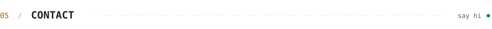
</picture>

Happy to talk about agents, RAG, or AI for operations.

**[LinkedIn](https://www.linkedin.com/in/purna-jear/)** &nbsp;·&nbsp; **[purnajear@gmail.com](mailto:purnajear@gmail.com)** &nbsp;·&nbsp; **[Claude Certified Architect credential](https://www.credly.com/badges/0e38ada0-e2b3-4cbf-90db-edad1b2abd92/public_url)**

<picture>
  <source media="(prefers-color-scheme: dark)" srcset="assets/footer-dark.svg">
  <source media="(prefers-color-scheme: light)" srcset="assets/footer-light.svg">
  
</picture>
